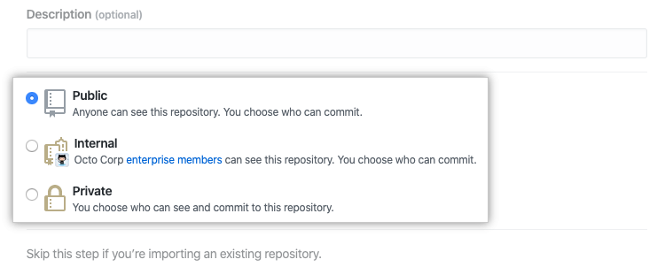
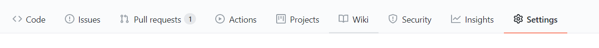

# Mkdocs_github pages

## 安装 mkdocs 和 Git 软件

### 安装mkdocs

1、 首先安装[Python](https://www.python.org/)（目前mkdocs最高支持python3.8）  
2、 安装pip（python3.8自带pip工具此步可省略）  
3、 使用pip下载Mkdocs库，执行  
	
```
pip  install  mkdocs
```  

### mkdocs help

输入   
 
```
mkdocs -h
```    

出现以下内容
  
```
Usage: mkdocs [OPTIONS] COMMAND [ARGS]...  

  MkDocs - Project documentation with Markdown.  

Options:  
  -V, --version  显示版本并退出.  
  -q, --quiet    取消警告  
  -v, --verbose  启用详细输出  
  -h, --help     显示此消息并退出.  

Commands:  
  build      构创建本地站点  
  gh-deploy  点将您的文档部署到GitHub页面  
  new        创建新的mkodcs文档  
  serve      运行内置的开发服务器  

```
### 安装git

访问[Git网站](https://git-scm.com/downloads)
下载最新的Git工具。  
  
设置默认，直接点 next 直到最后即可。 

### 配置Git

1、 打开 Git Bash。  
2、 设置 Git 用户名 
```
    git config --global user.name "Mona Lisa"
```   
3、 确认您正确设置了 Git 用户名：
```
    git config --global user.name           
    Mona Lisa
```   
4、 在 Git 中设置电子邮件地址。 您可以使用 GitHub 提供的 `no-reply` 电子邮件地址或任何电子邮件地址。
```
    git config --global user.email "email@example.com"
```   
5、 确认在 Git 中正确设置了电子邮件地址：
```
 $ git config --global user.email  
 email@example.com
```

  
## 注册GitHub网站

### 注册自己的账号

1、 访问[Github社区](https://github.com/)  
2、 点击右上角的`sign up`进行注册

<center>

</center>  
3、 输入用户名和邮箱并验证

<center>

</center>   
4、 登陆GitHub

<center>

</center>

### 上传SSH秘钥

1、 打开Git Bash  
2、 输入以下内容  	
```
    ssh-keygen -t rsa -b 4096 -C "your_email@example.com"
```
这将创建以所提供的电子邮件地址为标签的新 SSH 密钥。  
3、 提示您“Enter a file in which to save the key（输入要保存密钥的文件）”时，按 Enter 键。 这将接受默认文件位置。  
4、 在提示时输入安全密码。（可以不输）  
5、 根据提示找到SSH秘钥生成位置，找到生成的.pub文件，用记事本打开，复制里面的全部内容   
6、 登入GitHub网站，在页面的右上角，单击您的个人资料照片，然后单击 Settings（设置）

<center>

</center>  
7、 在用户设置侧边栏中，单击 SSH and GPG keys（SSH 和 GPG 密钥）。

<center>

</center>  
8、 单击 New SSH key（新 SSH 密钥）或 Add SSH key（添加 SSH 密钥）。

<center>

</center>  
9、 在 "Title"（标题）字段中，为新密钥添加描述性标签。

<center>

</center>  
10、 将密钥粘贴到 "Key"（密钥）字段。

<center>

</center>  
11、 单击 Add SSH key（添加 SSH 密钥）。

<center>

</center>  
12、 有可能会提示输入登入密码


## 创建自己的GitHub网站

### 创建网站仓库

1、 在任何页面的右上角，使用+下拉菜单选择 New repository（新建仓库）。
<center>

</center>  
2、 为仓库输入名称，建议使用<用户名>.github.io
<center>

</center>  
3、 （可选）添加仓库的说明。
<center>

</center>  
4、 选择仓库可见性。 
<center>

</center>  
5、 选择 Initialize this repository with a README（使用自述文件初始化此仓库）。
<center>

</center>  
6、 点击 Create repository
<center>

</center>  
7、 创建成功

### 克隆仓库到本地

1、 打开Git Bash软件  
2、 在本地合适的位置使用命令clone线上仓库到线下，输入：     
``` 
    git clone git@github.com:<用户名>/<用户名>.github.io.git
```  
此处建议使用SSH秘钥clone

### 创建 mkdocs 项目

1、 打开 Git Bash 软件
2、 使用`cd  <用户名>.github.io`进去仓库
3、 创建文档项目，执行  
``` 
    mkdocs new <文件名>
``` 
4、 执行完成后会在本地会生成一个文件夹，此文件夹中包含站点所有文件信息  
5、 输入 `cd 文件名`进入文件

### 配置项目

1、 打开 mkdocs 项目下的 `mkdocs.yml`  
2、 使用material主题，输入以下内容
 
```
    theme:                              
    name: material
```    
3、 编写目录
```
     nav:  
      - 介绍: index.md  
      - 安装:  
          - 本地环境搭建: install/local.md  
          - 发布至GitHub Pages: install/github-pages.md  
          - 发布至自己的HTTP Server: install/http-server.md  
      - 语法:  
          - 语法总览: syntax/main.md  
          - 标题: syntax/headline.md  
          - 段落: syntax/paragraph.md  
```
 上面的index.md就是放置在my-project/docs/index.md  
 上面的local.md就是放置在my-project/docs/install/local.md  
4、 添加扩展，只有添加了扩展，才能完美使用mkdocs-material官方支持的所有markdown语法,在mkdocs.yml里添加:
```  
  markdown_extensions:  
   - admonition    
   - codehilite:    
       guess_lang: false    
       linenums: false    
   - toc:    
      permalink: true    
   - footnotes    
   - meta    
   - def_list    
   - pymdownx.arithmatex    
   - pymdownx.betterem:    
       smart_enable: all    
   - pymdownx.caret    
   - pymdownx.critic    
   - pymdownx.details    
   - pymdownx.emoji:    
       emoji_generator: !!python     name:pymdownx.emoji.to_png    
   - pymdownx.inlinehilite    
   - pymdownx.magiclink    
   - pymdownx.mark    
   - pymdownx.smartsymbols    
   - pymdownx.superfences    
   - pymdownx.tasklist    
   - pymdownx.tilde    
```  
### 编写站点内容

 mkdocs项目下，找到一个以**docs**命名的文件夹，里面有一个index.md文件，编辑此文件，即编辑站点内容。

###启用本地服务查看呈现

1、 打开 Git Bash 软件  
2、 输入 `mkdocs serve` 站点开启成功后会的提示站点默认地址为：[https://127.0.0.1:8000](https://127.0.0.1:8000)
3、 打开网站，查看呈现

### 生成本地站点

1、 打开Git Bash软件  
2、 进入上步创建的mkdocs文件中  
3、 在创建的mkdocs文件夹目录下生成站点文件，执行
```
    mkdocs build
```   
4、 执行成功后会在本地文档项目文件夹中生成一个名为site的文件夹，site文件夹就是通过mkdocs编译生成的包含index.html的可被浏览器直接打开的静态前端站点

### 部署到Github


1、 直接在mkdocs项目下，将本地仓库中的文件同步到github的gh-pages  branch上  

```
    mkdocs gh-deploy
```  

2、 登入GitHub网站，进入所建仓库，点击`Setting`  
<center>

</center>  
3、 在`options`下找到`Source`    
<center>

</center>
4、 将`Branch`改为`gh-pages`，点击`Save` 
5、 此时通过*https://<用户名>.github.io*域名就可以访问到mkdocs静态网页站点 

##参考来源

[Github Help](https://docs.github.com/cn)