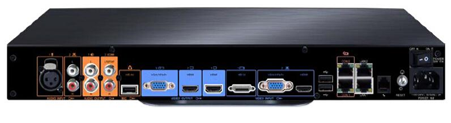
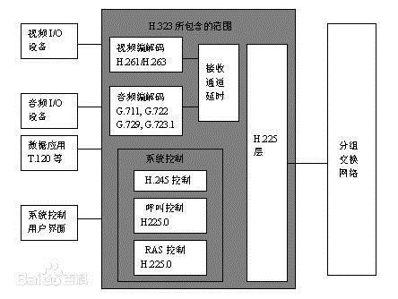

 
# 《视频会议培训教程》读书笔记（第一部分）——视频会议系统的基本概念和体系标准

阅读《视频会议培训教程》这本书，所记录的笔记，此部分为第一部分。
此部分主要讲述视频会议系统的基本概念和体系标准
## 视频会议系统概述

###视频会议系统的概念

- 通俗地说，视频会议系统就是为人们无法聚集到同一个地方召开会议的时候提供一种高科技的通信、协议和决策的一种现代化多媒体通讯手段。

- 专业地说，视频会议是利用现有通信网和数字信号压缩处理技术，将音频和数据信号处理后传到远端，实现面对面交流
	
- **形式**
	- 点对点、点对多点、多点对多点

- **应用**
	- MCU、视频会议终端、网闸、相关的配套外围设备

###视频会议系统的组成
	
- MCU、传输网络、会议控制软件、视频终端、各类外设

-  **视频会议终端**

	

桌面型  
	  
机顶盒型	  
  
会议室型	  
  

-  **会议控制软件**
	- 通常采用B/S设计结构，早期一般采用MCU内置Web服务端，客户通过PC端以浏览器方式登录。可实现服MCU等设备资源的集中控制和对视频会议等业务应用的全面调度。

	- **功能**：域管理、用户管理、设备管理、会议管理、资源管理、营帐管理、报表管理、运维管理、集群化管理等

-  **传输网络**
	
	- 传输网络即宽带连接方式，早期采用帧中继方式，目前通常采用SDH接入、MSTP接入方式和无线接入等方式。

	- **帧中继**：低网络时延、低设备费用、高带宽利用率，但带宽不能满足现代业务发展要求。

	- **SDH**：在接入路由器必须支持以太协议到E1链路的转换，维护比较复杂，对维护人员要求较高。

	- **MSTP**：满足增加带宽、改进业务传输质量、降低运维难度的要求，同时可以提供业务分类及服务质量能力，提高业务使用体验。

-  **附属设备**

	- 通常设备：投影仪、监视器/等离子屏、电子白板、麦克风、扩音设备、摄像机、播放机、录音机、中央控制器等

-  **MCU**

	- 多点控制单元也叫多点会议控制器。  
	- 多点视频会议系统的关键设备，类似于交换机  
	- **MCU处理过程**：  

**MCU**  	

###视频会议系统的发展历史
	

	

###视频会议系统的应用

-  **点对点会议**
	- 即两个会场进行一对一的视讯会议。
-  **多点讨论会议**	
	- 主要应用于对某课题或项目的分析讨论会议，处于自由发言状态
-  **多MCU分级会议应用**
	- 所有的MCU及终端设备能统一管理、分级控制，且增加新会议场点时易扩展。同级MCU在这种组网结构中地位平等。
-  **流媒体服务**	
	- 流媒体又叫流式媒体，开始它是指用视频传送服务器把节目当成数据包发出，传送到网络中。
	- 流媒体应用到视频会议中，大大改观了视频会议实时传输的效果，节省了带宽异界设备资源。

	- **单播**：从一台MCU发送的数据流只能传送给一台终端，对网络带宽要求高，但是非常灵活。

    - **组播**：构建一个具有组播能力的网络，可以让MCU只发送一个数据流给网络设备，网络设备转发给所有终端。

    - **点播**：对数据流可以开始、停止、后退、快进或暂停，主要应用于会议录像的点播
-  **其他应用**	
	- **视频会议系统**：
		- 远程教育与培训、远程医疗及指挥调度、可视视频指挥调度、高清多画面、高清电视墙、多方混音、录播、双流。
	- **视频调度系统**：
		- 应用于政法机关、交通、政府、电力、铁路、气象、工业厂矿、军队等领域

## 视频会议体系标准

-  **H.323简介**
	- **目标**：  在基于IP的网络环境中，实现可靠的面向音视频的数据和实时应用
	- H.323是一个框架性建设，它涉及终端设备、视频、音频和数据传输、通信控制、网络接口方面的内容，还包括了组成多点会议的多点控制单元（MCU）、网关以及网闸。
	- H.323是基于分组交换的多媒体通信系统。视频设备之间的通信依托数据网络，每个视频设备通过IP协议实现互联通信。

-  **SIP简介**
	- SIP是一个基于IP的应用层信令控制协议，用于创建、修改和释放一个或多个参与者的会话。
	- **优点**：简单、易于扩展、便于实现等
	- **不足**：①没有解决多点会议的方案②协议标准性不强③没有应用案例
   

[继续阅读](/reading_notes/audio-video_technology/){: .md-button }